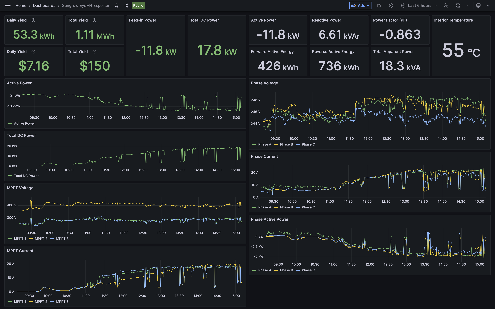

# Sungrow EyeM4 Exporter

A Prometheus exporter and Grafana dashboard for the Sungrow EyeM4 Dongle.


*Screenshot of Sungrow EyeM4 Exporter's Grafana dashboard*

## How does it work?

The exporter uses [@liamcottle/sungrow-eyem4-api](https://github.com/liamcottle/sungrow-eyem4-api) to connect to the websocket running on the Sungrow EyeM4 dongle and then processes and serves the data in the expected format for Prometheus to scrape.

## How to run it?

You can run the latest version of the exporter with `npx`, or you can download the package manually and run from source.

```
npx @liamcottle/sungrow-eyem4-exporter@latest serve --ip 192.168.1.175 --listen-port 8080
```

```
Sungrow EyeM4 Exporter

  A Prometheus exporter for the Sungrow EyeM4 Dongle. 

Usage

  $ sungrow-eyem4-exporter <options> <command> 

Command List

  help    Print this usage guide.                     
  serve   Serves prometheus style metrics at /metrics 

Options

  --ip string            IP address of the dongle. (e.g: 192.168.1.175)         
  --timeout string       Timeout in milliseconds for querying the dongle. (e.g: 10000)                                                 
  --listen-port string   Port the exporter will listen on. (e.g: 8080)          
```

## How to add to Prometheus?

You will need to add a scrape job to your `prometheus.yml` config file.

```
- job_name: sungrow_eyem4_exporter
  scrape_interval: 60s
  static_configs:
    - targets: ['1.2.3.4:8080']
```

> NOTE: Make sure to replace `1.2.3.4` with the IP address of the server running the exporter and `8080` with the listen port you set with `--listen-port`.

## How to add to Grafana?

You can download and import the [dashboard.json](grafana-dashboard/dashboard.json) into your Grafana instance.

> NOTE: You will need to update each of the metrics to pull from the correct IP address.
